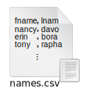

<!-- markdownlint-disable-next-line MD041 -->
[Grižti](index.md)

# Serializacijos formatai ir Struktūruotų duomenų žymėjimo kalbos

[Serializacijos formatas](https://en.wikipedia.org/wiki/Serialization#Serialization_formats) - tai taisyklės, apibrėžiančios duomenų struktūrų arba objektų būsenos pavidalą, tinkamą išsaugoti saugojimo įrenginiuose ar perduoti tinklais tam, kad vėliau tas duomenų struktūras ar objektus būtų galima atkurti. Struktūruotų duomenų žymėjimo kalbos - tai žmogui lengvai perskaitomi (*human readable*) serializacijos formatai, leidžiantys duomenis saugoti tekstinio dokumento pavidalu.

Duomenų serializacijos pavyzdžiai:

* Bendrosios paskirties žymėjimo kalbomis

  * XML
    * [XAML](https://en.wikipedia.org/wiki/Extensible_Application_Markup_Language) ([pavyzdys](data-series/ui-data-xaml.md))
  * [QML](https://en.wikipedia.org/wiki/QML) (pavyzdys, [pavyzdys](data-series/qml-like.  * [KDL](https://kdl.dev/) (pavyzdys)
md))
  * [PDL](https://pml-lang.dev/) (pavyzdys)
  * [PDML](https://pdml-lang.github.io/)  (pavyzdys)

* Specializacijos formatais (duomenų žymėjimo kalbomis)

  [Serializacijos formatų palyginimas](https://en.wikipedia.org/wiki/Comparison_of_data-serialization_formats)

  * [DSV](https://en.wikipedia.org/wiki/Delimiter-separated_values)
    * [CSV](https://en.wikipedia.org/wiki/Comma-separated_values) 
    * [TSV](https://en.wikipedia.org/wiki/Tab-separated_values)
  * [JSON](https://www.json.org/json-en.html) 
    * [JSON5](https://json5.org/)
  * [AXON](https://pyaxon.readthedocs.io/en/latest/)
  * [YAML](https://yaml.org/spec/1.2.2/) 
  * [SDL](https://sdlang.org/)

[Grižti](index.md)
