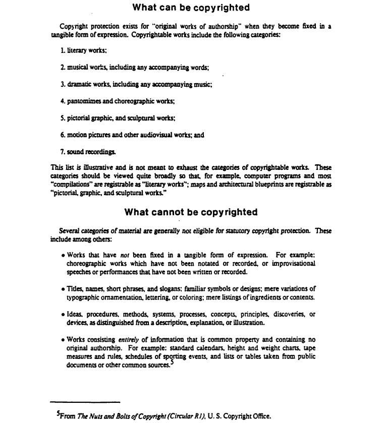

<!-- markdownlint-disable-next-line MD041 -->
[Grįžti](../index.md)

# Scribe

Pavyzdžiai iš [Scribe: A Document Specification Language and it's Compiler](http://www.columbia.edu/cu/computinghistory/scribe.pdf), 49–52 psl.

## "Figure 14. Simple Scribe manuscript." (p. 49)

```scribe
@Heading(What can be copyrighted)
Copyright protection exists for ''original works of authorship'' when they
become fixed in a tangible form of expression. Copyrightable works include the
following categories:
@begin(enumerate)
literary works;

musical works, including any accompanying words;

dramatic works, including any accompanying music;

pantomimes and choreographic works;

pictorial graphic, and sculptural works;

motion pictures and other audiovisual works; and

sound recordings.

@End(enumerate)
This list is illustrative and is not meant to exhaust the categories of
copyrightable works. These categories should be viewed quite broadly so that,
are registrable as
for example, computer programs and most ''compilations'' are registrable as
''literary works''; maps and architectural blueprints are registrable as
''pictorial, graphic, and sculptural works.''

@Heading( What cannot be copyrighted)
Several categories of material are generally not eligible for
statutory copyright protection. These include among others:
@Itemize[
Works that have @i[notj been fixed in a tangible form of expression. For
example: choreographic works which have not been notated or recorded, or
improvisational speeches or performances that have not been written or recorded.

Titles, names, short phrases. and slogans; familiar
symbols or designs; mere variations of typographic
ornamentation, lettering, or coloring; mere listings of
ingredients or contents.

Ideas, procedures, methods systems, processes, concepts, principles.
discoveries, or devices, as distinguished from a description, explanation, or
illustration.

Works consisting @i[entirely] of information that is comon property and
containing no original authorship. For example: standard calendars, height and
weight charts, tape measures and rules, schedules of sporting events, and lists
or tables taken from public documents or other common sources.@Foot<
From @i[The Nuts and Bolts of Copyright (Circular RI)], U. S. Copyright Office.>
]
```

## "Figure 15: Document produced from manuscript in Figure 14." (p. 50)



## "Figure 16: An elaborate scribe manuscript." (p. 51)

```scribe
@Make(Wedding Program)
@Style(Font "Times Roman 10")
@begin(Introductory)
The Marriage of Loretta Roso Guarino and Brian Keith Reid
Saturday, May 12, 1979
The Church of St. Michael and All Angels,     Tucson, Arizona
@Separator()
@end(Introductory)
@Heading(Voluntary)
@Begin(Verse)
@i[Siciliano], from @i[Sonata #2 for Flute and Keyboard], J. S. Bach
@i[Prelude in Classic Style], Gordon Young
@i[Andante], from @i[Organ Concerto in F. Major], G. F. Handel
@end(Verse)
@Heading(Processional)
@begin(Verse)
@i[Adagio in A Minor], from @i[Toccata, Adagio, and Fugue in C Major], J. S. Bach
@i[Rigaudon], Andre Campra
@end(Verse)
The text for the Marriage Ceremony may
be found in the @i[Book of Common Prayer] beginning on page 423.
@Heading(The Invocation@PageNum[p. 423])
@Heading(The Ministry of the Word@pageNum{p.425})
@SubHeading(The Old Testament@>Tobit 8:5-80\)
@SubHeading(The New Testament@>I Corinthians 13:1-130\)
@SubHeading(Hymn 363)
@SubHeading(The Gospel@>John 15:9-120\)
@SubHeading(Homily@>Fr. John Fowler\)
@Heading(The Marriage@Pagenum[p. 427])
@SubHeading(The Exchange of Vows)
@SubHeading(The Prayers)
@Heading(The Blessing of the Marriage@Pagenum[p. 430])
@SubHeading(The Blessing)
@SubHeading(The Peace)
@Heading(The Holly Communion@Pagenum[p. 381])
@SubHeading(The Great Thanksgiving)
@SubHeading(The Breaking of the Bread)
@SubHeading(The Prayer of Thanksgiving@>p. 423)
@SubHeading(Benediction and Dismissal)
@Heading(Processional)
@begin(Verse)
@i[Toccata], from @i[Symphony #5 for Organ], C. M. Windor
@end(Verse)
```

## "Figure 17: Document produced from manuscript shown in Figure 16. (p. 52)


[Grįžti](../index.md)
